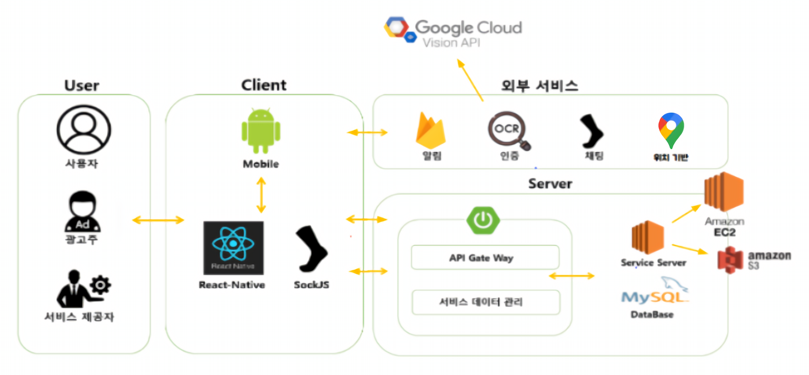

# PickMen


   <br>


  ## :heart: 개요
PickMen은 모바일 앱으로 같은 대학 내에서 멘토와 멘티를 매칭시켜주는 멘토링 매칭 플랫폼이다.</br></br>
신입생과 저학년 대학생들은 전공 지식과 학교 생활에 대해 알고 싶은데, 물어볼 데가 없거나 정보를 얻을 주체가 동아리나 소학회에만 한정되어 있다.
이를 위해 멘토링 프로그램이 존재하지만, 실제 참여율은 저조하고 멘토링을 의무적으로 참여해야하는 등 부담을 가질 수 있다.</br></br>
PickMen은 "이러한 멘토링을 모바일 앱으로 보다 쉽고, 자율적으로 제공하면 어떨까?"라는 고민에서 시작되었다.</br></br>
멘티는 멘토들의 프로필 리스트로부터 멘토를 선택할 수 있고, 멘토와의 채팅을 통해 대학생들이 원하는 전공 지식 및 학교 생활 등에 대한 정보를 얻을 수 있다.그리고 찾는 멘토가 없다면 원하는 정보를 얻기 위해 구인 게시판에서 멘토를 구할 수 있다.
   <br>
## :orange_heart: 기대효과
PickMen은 멘토링 서비스를 앱으로 제공하여 멘토링에 접근하는 것에 대한 부담감을 줄인다. </br>그리고 성적 인증된 멘토를 통한 멘토링 서비스를 통해 대학생들의 전반적인 학습 수준 향상을 기대할 수 있다.</br> 또한, 같은 학교 지역 내 멘토들을 선택할 수 있어 학교, 동네 내에서 유대감 형성 및 학습 효과 기대할 수 있다. </br></br>
$ \Rightarrow $ 같은 학교, 인근 지역 내의 성적표 인증을 바탕으로 한 멘토링 플랫폼을 형성한다
   <br>
## :yellow_heart: 시스템 구조


- React-Native
  - Front-end client 구현
    <br>
       <br>
- Spring-Boot
  - Back-end server 구현
       <br>
       <br>
- SockJS
  - 실시간 통신, 채팅을 위해 사용
 <br><br>
- Google Cloud Vision OCR API
  - 이미지에서 텍스트 추출
  - 성적표 인증을 위해 사용
     <br><br>

- Google Maps API
  - 지역에 따른 멘토링 서비스를 위해 사용
    <br><br>

- Firebase
  - 채팅 알림을 위해 사용
<br>

## :green_heart: 개발 도구 및 버전
- 
- 
- 
- 
- 

   <br>
## :blue_heart: 외부 API
- [Firebase](https://firebase.google.com/)
- [Google Maps](https://developers.google.com/maps/)
- [Google Cloud Vision API](https://cloud.google.com/vision/docs/ocr?hl=ko)

   <br>
## :purple_heart: 실행 방법
- Clone the repository
```bash
git clone https://github.com/08-PickMen/PickMen_App.git
cd Front
```
- Install with npm
```bash
npm install
```
- Run (Front)
```bash
react-native run-android
```
- Build (Backend)
```bash
cd Backend/backend
./mvnw build
```
- Run (Backend)
```bash
./mvnw bootRun
```

   <br>
   
## :heartpulse: 구현 기능


### :question: 멘티
<details>
<summary>1. 회원가입</summary>
<div markdown="1">       

   
   
   

</div>
</details>
<details>
<summary>2. 프로필 수정</summary>
<div markdown="1">       

😎숨겨진 내용😎

</div>
</details>
<details>
<summary>3. 멘토 탐색</summary>
<div markdown="1">       

  1. 멘토 프로필 탐색
    
  2. 멘티 구인 게시물 탐색

</div>
</details>
<details>
<summary>4. 멘토와의 채팅</summary>
<div markdown="1">       

😎숨겨진 내용😎

</div>
</details>
<details>
<summary>5. 멘토 평가</summary>
<div markdown="1">       

😎숨겨진 내용😎

</div>
</details>

### :exclamation: 멘토

<details>
<summary>1. 회원가입</summary>
<div markdown="1">       

😎숨겨진 내용😎

</div>
</details>
<details>
<summary>2. 프로필 수정</summary>
<div markdown="1">       

😎숨겨진 내용😎

</div>
</details>
<details>
<summary>3. 멘티 탐색</summary>
<div markdown="1">       

  1. 멘토 구인 게시물 탐색

</div>
</details>
<details>
<summary>4. 멘티와의 채팅</summary>
<div markdown="1">       

😎숨겨진 내용😎

</div>
   </details>

   <br>
   
## 👍 Author
---
| 이름   | Link to                                          |
| ------ | ------------------------------------------------ |
| 편동혁 | [@HyukP](https://github.com/HyukP)               |
| 하종수 | [@jong02112004](https://github.com/jong02112004) |
| 심재철 | [@심재철](https://github.com/wocjf0513)          |
| 심규원 | [@kyuwon](https://github.com/skwony)             |
