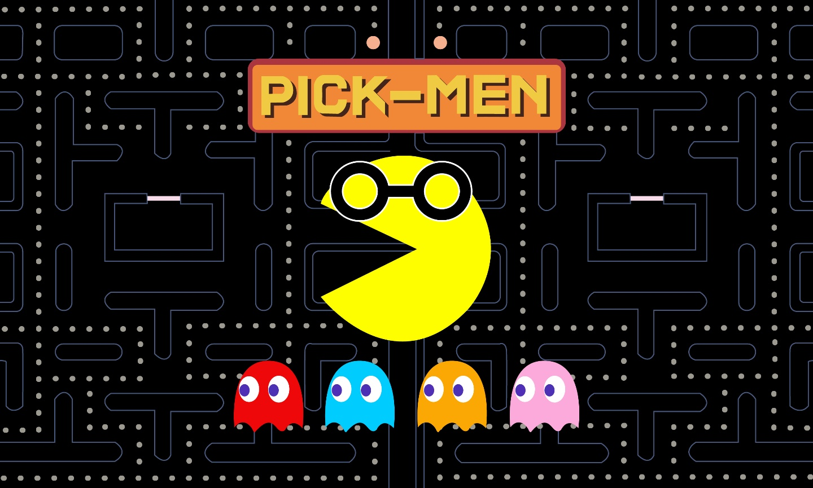

# PickMen

## 개요

PickMen은 모바일 앱으로 대학교에서 멘토링을 할 수 있도록 멘토를 매칭시켜주는 멘토링 매칭 플랫폼이다.

대학생들은 전공 지식 및 학교 생활에 대한 정보를 얻고 싶은데, 신입생과 저학년들은 검색이 미숙하고 정보를 얻을 주체가 동아리나 소학회에만 한정되어 있다.
이에 대한 방안으로 멘토링 프로그램이 존재하지만, 실제 참여율은 저조하고 멘토링을 의무적으로 참여해야하는 등 부담을 가질 수 있다.

PickMen은 이러한 멘토링을 모바일 앱으로 보다 쉽고, 자율적으로 제공하면 어떨까라는 고민에서 시작되었다. 멘티는 멘토들의 프로필 리스트로부터 멘토와 매칭할 수 있고, 멘토와의 채팅을 통해 대학생들이 원하는 전공 지식 및 학교 생활 등에 대한 정보를 얻을 수 있게 하였다. 그리고 찾는 멘토가 없다면 원하는 정보를 얻기 위해 구인 게시판에서 멘토를 구할 수 있다.

## 기대효과

PickMen은 멘토링 서비스를 앱으로 제공하여 멘토링에 접근하는 것에 대한 부담감을 줄이고자 한다. 그리고 멘토링 서비스를 통해 대학생들의 전반적인 학습 수준 향상을 기대할 수 있다. 또한 대학생들이 원하는 전공 지식이나 학교 생활에 관한 정보를 얻을 수 있는 새로운 플랫폼 형성을 기대한다.

## 시스템 구조


- React-Native

  - Front-end client 구현
    <br>

- Spring-Boot

  - Back-end server 구현
    <br>

- SockJS

  - 실시간 통신, 채팅을 위해 사용
    <br>

- Google Cloud Vision OCR API

  - 이미지에서 텍스트 추출
  - 성적표 인증을 위해 사용
    <br>

- Firebase
  - 채팅 알림을 위해 사용

## 개발 도구 및 버전

- 

- 

- 

- 

- 

## 외부 API

- [Firebase](https://firebase.google.com/)

- [Google Maps](https://developers.google.com/maps/)

- [Google Cloud Vision API](https://cloud.google.com/vision/docs/ocr?hl=ko)

## 실행 방법

- Clone the repository

```bash
git clone https://github.com/08-PickMen/PickMen_App.git
cd Front
```

- Install with npm

```bash
npm install
```

- Run (Front)

```bash
react-native run-android
```

- Build (Backend)

```bash
cd Backend/backend
./mvnw build
```

- Run (Backend)

```bash
./mvnw bootRun
```

## 구현 기능

### 멘토
